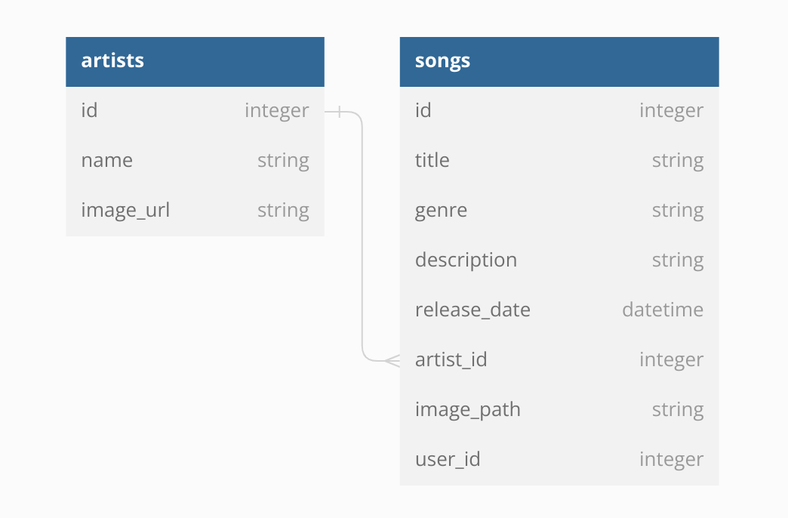

# Artist-Songs Music Library
This is a music library application that allows you to manage artists and their songs. It provides a RESTful API for performing CRUD (Create, Read, Update, Delete) operations on artists and songs. The application uses Ruby on Rails and ActiveRecord for data management.

# Front-end Repository

  <a href="https://github.com/CVLGeneral/Melodify" target="_blank">Link</a>

   

# Entity Relationship Diagram (ERD)
ERD Diagram

# Getting Started
To get started with the application, follow these steps:

Clone the repository to your local machine.
Run bundle install to install the required gems.
Set up the database by running the migrations: rake db:migrate.
Seed the database with sample data: rake db:seed.
# Models
# Artist
The Artist model represents an artist in the music library. It has the following attributes:

name: The name of the artist.
image_url: The URL of the artist's image.
# Associations
has_many :songs: Represents the songs created by the artist.
# Song
The Song model represents a song in the music library. It has the following attributes:

title: The title of the song.
genre: The genre of the song.
description: A description of the song.
release_date: The release date of the song.
image_path: The path to the song's image.
artist_id: The ID of the artist associated with the song.
# Associations
belongs_to :artist: Represents the artist who created the song.
# API Routes
The Artist-Songs Music Library application provides the following API routes:

GET "/artists": Returns all artists in the music library.

GET "/artists/:id": Returns a specific artist by their ID.

GET "/artists/:id/songs": Returns all songs by a specific artist.

POST "/artists": Creates a new artist in the music library.

PUT "/artists/:id": Updates a specific artist by their ID.

DELETE "/artists/:id": Deletes a specific artist by their ID.

GET "/songs": Returns all songs in the music library.

GET "/songs/:id": Returns a specific song by its ID.

POST "/songs": Creates a new song in the music library.

PUT "/songs/:id": Updates a specific song by its ID.

DELETE "/songs/:id": Deletes a specific song by its ID.

Make HTTP requests to these routes to interact with the music library. Use the appropriate request methods (GET, POST, PUT, DELETE) and include any necessary parameters in the request body or URL.

# Usage
After setting up the application, you can interact with the models using the Rails console or by making API requests.

#ruby
Start the Rails console
rake console

# Create a new artist
artist = Artist.create(name: 'Artist Name', image_url: 'https://example.com/artist-image.jpg')

# Create a new song
song = Song.create(
  title: 'Song Title',
  genre: 'Genre',
  description: 'Description of the song',
  release_date: DateTime.now,
  image_path: 'path/to/song-image.jpg',
  artist_id: artist.id
)

# Update an artist
artist.update(name: 'New Artist Name')

# Delete a song
song.destroy

Feel free to explore the models and their methods to understand the functionality of the application.

## Contributing
Contributions are welcome! If you find any issues or want to add new features, please open an issue or submit a pull request.

## License
The project is available as open source under the terms of the MIT License.